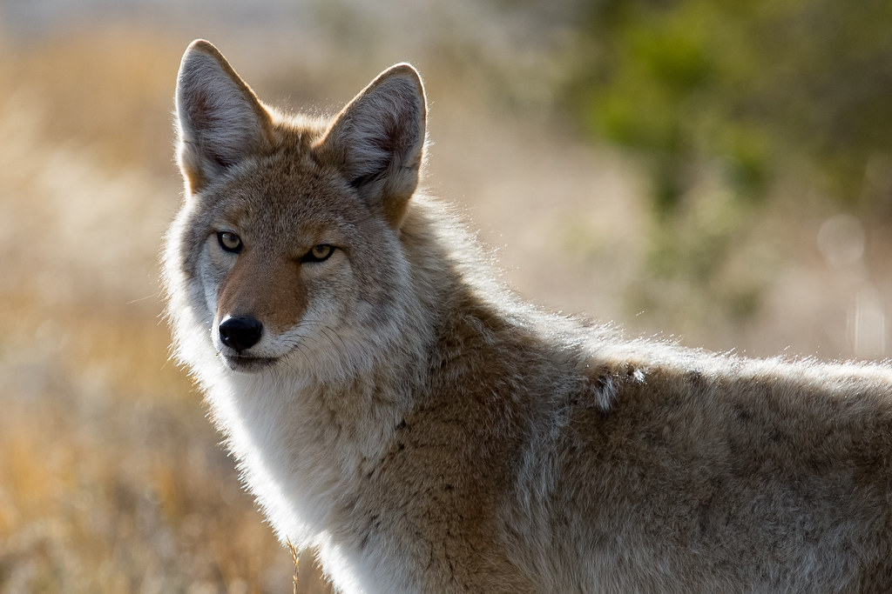

# Canis

A collection of random codes to interface with sensors, much like the
Cynomys, but expected to run on a more feature-full platform like a
Raspberry Pi or a server to monitor stuff.

Canis is a genus of the Caninae containing multiple extant species, such as wolves, dogs, coyotes and jackals. Species of this genus are distinguished by their moderate to large size, their massive, well-developed skulls and dentition, long legs, and comparatively short ears and tails.

## Why canis for a name?

Coyotes eat praire dogs, so it seemed appropriate

## Hardware

Pretty much anywhere where the full Python interpreter will run.
