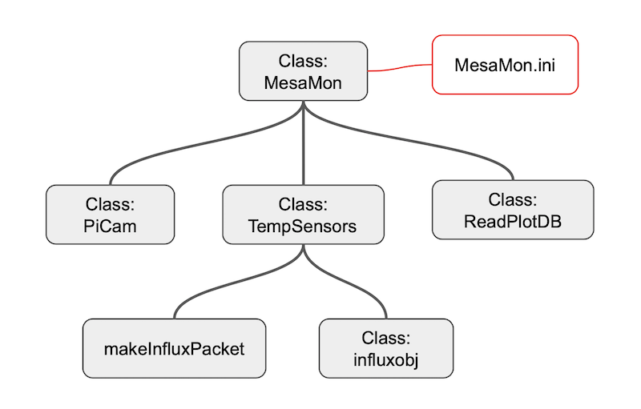

## A program to monitor things at the mesa.

* cryotiger compressor temperature
* ambient temperature
* ARC controller temperature
* ARC controller power supply temperature
* status of dome shutter

### Cynomys

Image credit: Ronan Donovan for The New York Times

Source: https://pressfrom.info/us/news/us/-48831-can-prairie-dogs-talk.html

Cynomys - A taxonomic genus within the family Sciuridae – the prairie dogs, rodents native to the grasslands of 
central North America.  Here in Flagstaff, the dominant population of prarie dogs are _cynomys gunnisoni_, or 
[Gunnison's Prarie Dog](https://en.wikipedia.org/wiki/Gunnison%27s_prairie_dog).

These are the small devices that will ride along on the back end of various telescopes, and host the temperature
sensors for the ARC devices.  They communicate via WiFi to the base stations in each dome that both 
host the local database as well as measure the cryotiger temperature.

#### Why cynomys for a name?  

I see prarie dogs everywhere around town!  Plus, prior Lowell projects have used small pest names 
already (tick, flea, mite, etc.) so I moved up in scale slightly to the rodent population.  Prarie dogs seemed 
like a good fit for all this additional monitoring, they have a complex warning/community alert structure.
